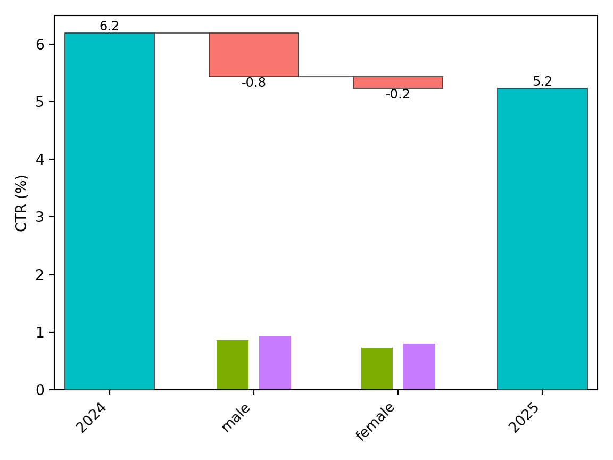
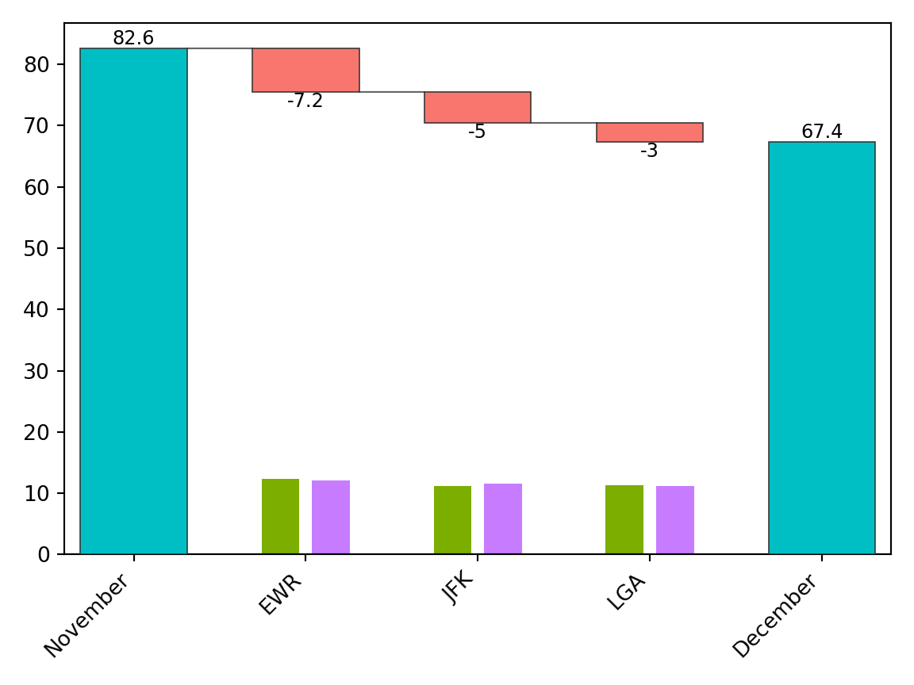
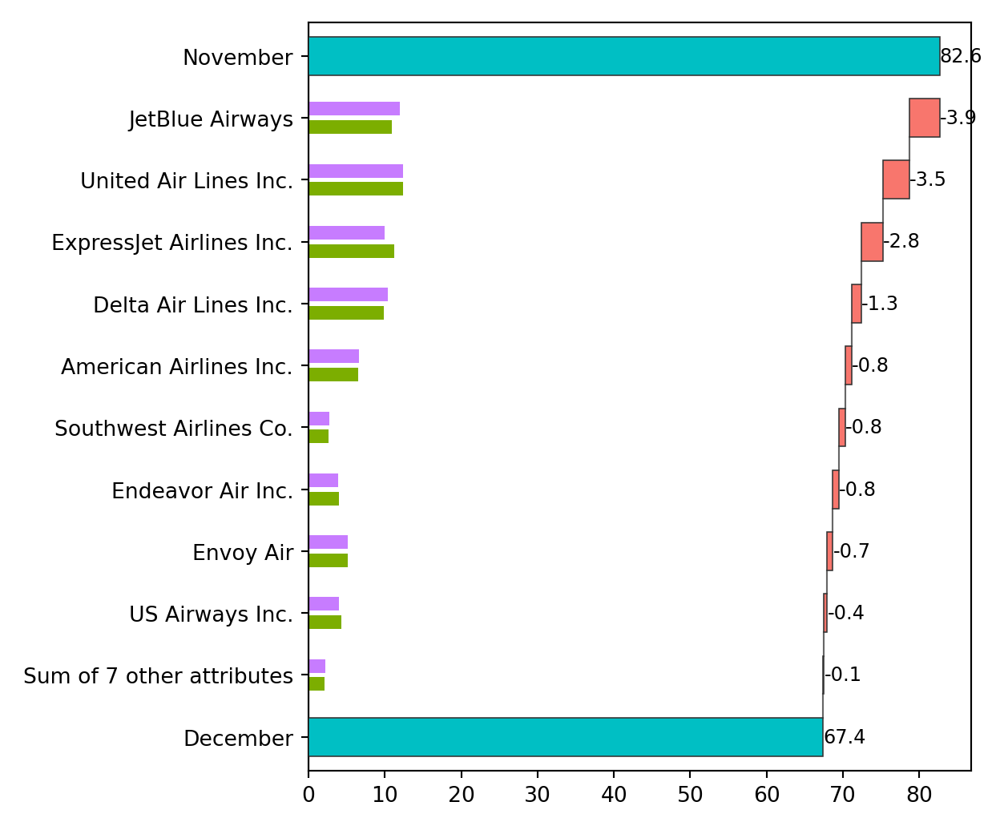
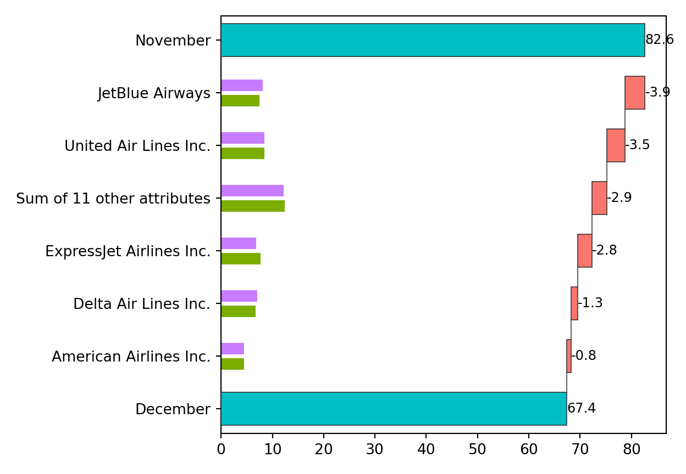
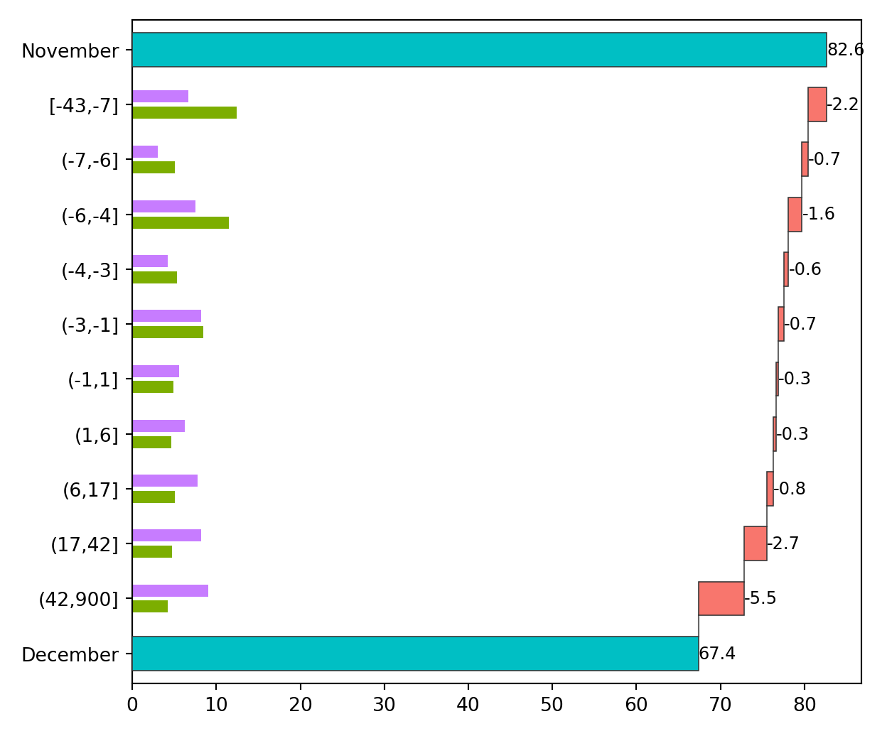
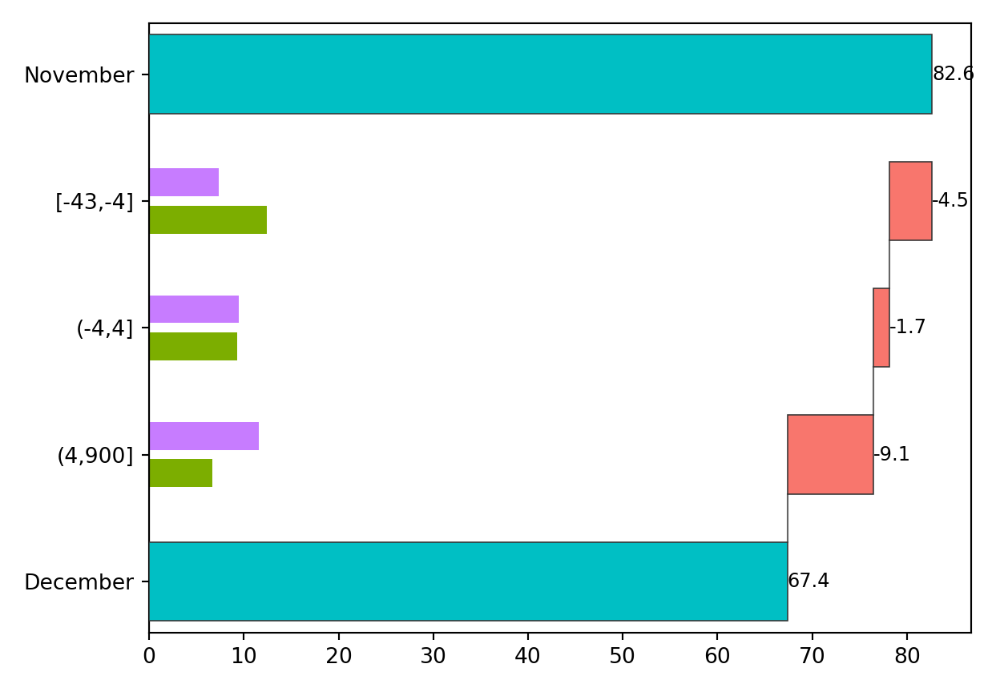
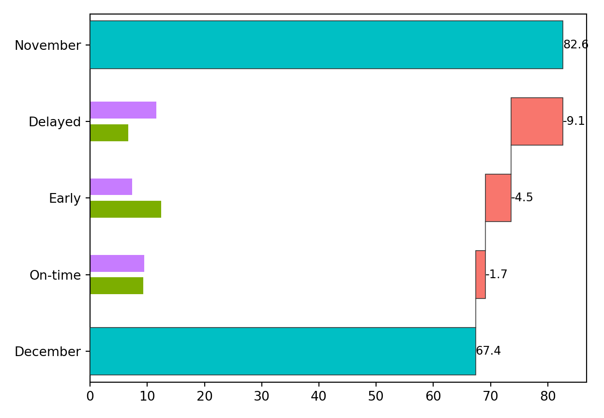
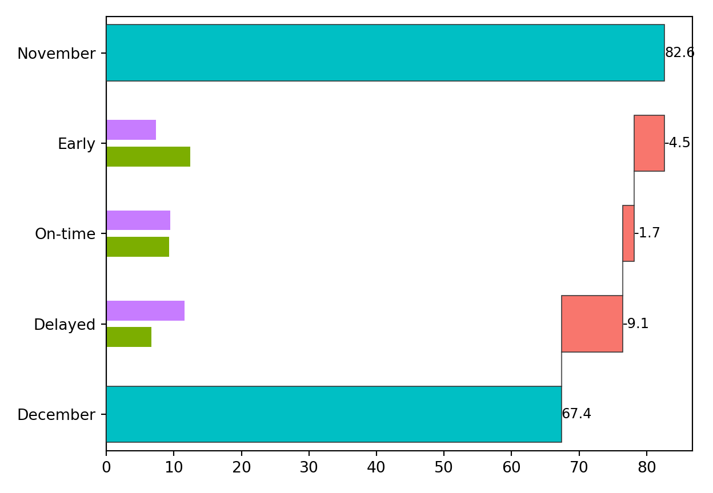

<!-- README.md is generated from README.Rmd. Please edit that file -->

# TheseusPlot: Visualizing Decomposition of Differences in Rate Metrics

<!-- badges: start -->

[](https://pypi.org/project/theseusplot/)
[](https://pepy.tech/project/theseusplot)
[](https://github.com/hoxo-m/TheseusPlot_py/actions/workflows/ci.yml)
<!-- badges: end -->

## 1. Overview

In data analysis, when a metric differs between two groups, we often
want to investigate whether a particular subgroup is driving that
difference. For example, when you observe a decline in a key metric
compared with the previous year, you may want to conduct a more detailed
analysis. In such an analysis, you might focus on one attribute, such as
gender, and examine whether the decline was driven by male users, female
users, or both. However, this type of analysis is challenging when the
metric is a rate, because each subgroup’s contribution to the rate
difference cannot be simply calculated, unlike in the case of volume
metrics.

To address this issue, we propose an approach inspired by the story of
the *[Ship of Theseus](https://en.wikipedia.org/wiki/Ship_of_Theseus)*.
This approach involves gradually replacing the components of one group
with those of another, recalculating the metric at each step. The change
in the metric at each step can then be interpreted as the contribution
of each subgroup to the overall difference.

For instance, suppose the click-through rate (CTR) was 6.2% in 2024 and
decreased to 5.2% in 2025. Again, we focus on gender. We replace the
male users in the 2024 dataset with the male users from 2025 and
recalculate the CTR. As a result, the CTR would drop by 0.8 percentage
points, reaching 5.4%. In this case, the contribution of male users to
the change in CTR is -0.8 percentage points. Next, we replace the female
users from 2024 with those from 2025. The dataset then consists entirely
of 2025 data, and CTR drops by 0.2 percentage points, reaching 5.2%.
Thus, the contribution of female users is -0.2 percentage points.

When visualized, the results appear as follows:



From this plot, we can see that the decline in CTR is primarily driven
by male users. We call this visualization the “Theseus Plot.”

The **TheseusPlot** package is designed to make it easy to generate
Theseus Plots for any column that defines subgroups.

## 2. Installation

You can install the **theseusplot** package from
[PyPI](https://pypi.org/project/theseusplot/) with:

``` bash
python -m pip install theseusplot
```

You can install the optional dependencies for examples and documentation
data with:

``` bash
python -m pip install "theseusplot[examples]"
```

You can install the development version from
[GitHub](https://github.com/hoxo-m/TheseusPlot_py) with:

``` bash
python -m pip install "git+https://github.com/hoxo-m/TheseusPlot_py.git"
```

## 3. Details

### 3.1 Prepare Data

To create Theseus plots, you need two data frames that share common
columns.

We use the 2013 New York City flight data from
[nycflights13](https://cran.r-project.org/package=nycflights13) as a
demo dataset. Here, we will define the rate metric as the proportion of
flights that arrived on time. In December 2013, the on-time arrival rate
dropped substantially compared to November. We investigate the cause
using a Theseus plot.

First, we create an `on_time` column in the data frame to indicate
whether each flight arrived on time. Next, we extract the flights for
November and December into separate data frames to form two comparison
groups. The on-time arrival rate was 83% in November and dropped to 67%
in December.

``` python
from nycflights13 import airlines, flights

data = (
    flights.dropna(subset=["arr_delay"])
    .assign(on_time=lambda df: df["arr_delay"] <= 15)
    .merge(airlines, on="carrier")
    .assign(carrier=lambda df: df["name"])
    .loc[
        :,
        [
            "year",
            "month",
            "day",
            "origin",
            "dest",
            "carrier",
            "dep_delay",
            "on_time",
        ],
    ]
)

print(data.head())
#>    year  month  day origin dest                 carrier  dep_delay  on_time
#> 0  2013      1    1    EWR  IAH   United Air Lines Inc.        2.0     True
#> 1  2013      1    1    LGA  IAH   United Air Lines Inc.        4.0    False
#> 2  2013      1    1    JFK  MIA  American Airlines Inc.        2.0    False
#> 3  2013      1    1    JFK  BQN         JetBlue Airways       -1.0     True
#> 4  2013      1    1    LGA  ATL    Delta Air Lines Inc.       -6.0     True

data_nov = data[data["month"] == 11]
data_dec = data[data["month"] == 12]

print(data_nov["on_time"].mean())
#> 0.8264802936487339
print(data_dec["on_time"].mean())
#> 0.6738712065136936
```

### 3.2 Basics

Using the two prepared data frames, we first create a `ship` object. The
`ship` object is an instance of the Python class `ShipOfTheseus`,
designed to create Theseus plots.

``` python
from theseusplot import create_ship

ship = create_ship(
    data_nov,
    data_dec,
    y="on_time",
    labels=("November", "December"),
)
```

If `labels` is omitted, the default labels are `"Baseline"` and
`"Comparison"`. Plot values are displayed with one decimal place by
default. You can customize the endpoint labels, axis labels, and
displayed precision with `labels`, `x_label`, `y_label`, and `digits`.

You can create a Theseus plot by passing column names to the `plot`
method of a `ship` object. For example, to create a Theseus plot for the
airport of origin:

``` python
fig, ax = ship.plot("origin")
fig.show()
```



New York City has three major airports, and Newark Liberty International
Airport (EWR) accounted for the largest share of the decline in the
on-time arrival rate.

Note that the number of flights at each airport matters, as a larger
flight volume is expected to have a greater impact. To make this clear,
the Theseus plot displays the sample size for each group within each
subgroup as a bar chart. From this, we see that the number of flights is
similar across airports, allowing for direct comparison of
contributions.

In summary, a Theseus plot consists of two components:

- A waterfall plot showing how much each subgroup contributed to the
  change in the metric.
- A bar chart representing the sample size for each group within each
  subgroup.

A `ship` object also provides the `table` method to inspect the exact
values used in the Theseus plot.

``` python
ship.table("origin")
#>   origin   contrib    n1    n2    x1    x2     rate1     rate2
#> 0    EWR -0.071873  9603  9410  7995  5910  0.832552  0.628055
#> 1    JFK -0.050249  8645  8923  7290  6142  0.843262  0.688334
#> 2    LGA -0.030487  8723  8687  7006  6156  0.803164  0.708645
```

### 3.3 Flipping the Plot

When there are many subgroups, a Theseus plot can become hard to read.
In such cases, you can swap the x- and y-axes for better visualization.

``` python
fig, ax = ship.plot_flip("carrier")
fig.show()
```



When the number of subgroups is large, those with small contributions
are automatically grouped together. By default, this happens when there
are more than 10 subgroups, but the threshold can be adjusted with the
`n` argument.

``` python
fig, ax = ship.plot_flip("carrier", n=6)
fig.show()
```



From this plot, JetBlue Airways and United Air Lines appear to have the
largest contributions to the decline in on-time arrival rate.

### 3.4 Automatic Discretization of Continuous Values

Theseus plots are primarily designed for categorical variables. If a
continuous column is provided, it is automatically discretized. For
example, we can create a Theseus plot for departure delays.

``` python
fig, ax = ship.plot_flip("dep_delay")
fig.show()
```



By default, continuous variables are discretized so that each subgroup
has roughly equal sample sizes, with the number of bins set to 10. You
can modify these settings by passing the return value of
`continuous_config()` to the `continuous` argument.

``` python
from theseusplot import continuous_config

fig, ax = ship.plot_flip("dep_delay", continuous=continuous_config(n=3))
fig.show()
```



This result shows that both a decrease in on-time departures and an
increase in delayed departures contributed to the decline in on-time
arrival rate.

### 3.5 Controlling Category Order with Categorical Columns

By default, string-like columns are ordered by contribution size in
`table()`, `plot()`, and `plot_flip()`. If you want to use a specific
order instead, convert the column to an ordered categorical column. For
categorical columns, TheseusPlot respects the order of the category
levels.

This is useful when the categories have a natural order, such as
`"Low"`, `"Medium"`, and `"High"`, or when you want to define the order
manually.

For example, suppose we classify departure delays into three categories:
`"Early"`, `"On-time"`, and `"Delayed"`.

When `departure_type` is a string column, the categories are ordered by
their contributions.

``` python
import numpy as np


def to_departure_type(series):
    return np.select(
        [series <= -4, series <= 4, series > 4],
        ["Early", "On-time", "Delayed"],
        default="Delayed",
    )


data_nov = data_nov.assign(
    departure_type=lambda df: to_departure_type(df["dep_delay"]),
)
data_dec = data_dec.assign(
    departure_type=lambda df: to_departure_type(df["dep_delay"]),
)

ship = create_ship(
    data_nov,
    data_dec,
    y="on_time",
    labels=("November", "December"),
)

fig, ax = ship.plot_flip("departure_type")
fig.show()
```



To display the categories in a meaningful order, convert
`departure_type` to an ordered categorical column and specify the
category order.

``` python
import pandas as pd
from pandas.api.types import CategoricalDtype


departure_type_order = CategoricalDtype(
    categories=["Early", "On-time", "Delayed"],
    ordered=True,
)


def to_departure_type(series):
    values = np.select(
        [series <= -4, series <= 4, series > 4],
        ["Early", "On-time", "Delayed"],
        default="Delayed",
    )
    return pd.Series(values, index=series.index).astype(departure_type_order)


data_nov = data_nov.assign(
    departure_type=lambda df: to_departure_type(df["dep_delay"]),
)
data_dec = data_dec.assign(
    departure_type=lambda df: to_departure_type(df["dep_delay"]),
)

ship = create_ship(
    data_nov,
    data_dec,
    y="on_time",
    labels=("November", "December"),
)

fig, ax = ship.plot_flip("departure_type")
fig.show()
```



You can change the category levels to display the categories in any
order you choose.
